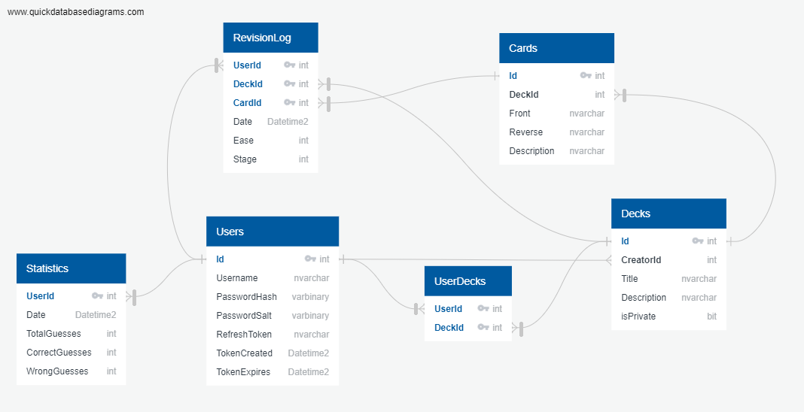

FlashcardsApp
====================

About
---------------------

This app is developed for quick and easy memorising large quantities of words/terms/phrases.

FlashcardsApp works best in learning:
- langauges,
- scientific terms,
- geography,
- and so on!

### Comparison to other applications.

The largest app on the market offering flashcards is Anki. \
Albeit Anki is awesome and, for now, far superior to this app, 
it has a major downside: all decks and cards are stored locally. Migrating from one device to another requires lot of effort.
#### Here comes FlashcardsApp!
FlashcardsApp meets expectations of those, who wish to learn from multiple devices alternately!
It stores all information in global database, so they can be accessed from any device that has connection to internet.

## Stack

Front end
---------------------
- HTML
- CSS
- JavaScript
- React
- Bootstrap

Back end
---------------------
- C#
- ASP.NET Core
- Entity Framework
- SQL Server
- xUnit
- Mock

Documentation
---------------------
Documentation may be found on my [GitHub Pages](https://jczarny.github.io/FlashcardsApp/index.html).

How to run
---------------------

In order to run this application, all you have to do is download it and put your own connectionString in appsettings.json

> Tested in Windows only.

## Application Screens

<table>
  <tr>
    <td>Home</td>
  </tr>
  <tr>
    <td></td>
  </tr>

  <tr>
    <td>Learn</td>
  </tr>
  <tr>
    <td></td>
  </tr>

  <tr>
    <td>Login</td>
  </tr>
  <tr>
    <td></td>
  </tr>

  <tr>
    <td>Edit Deck</td>
  </tr>
  <tr>
    <td></td>
  </tr>
 </table>

## DB diagram

